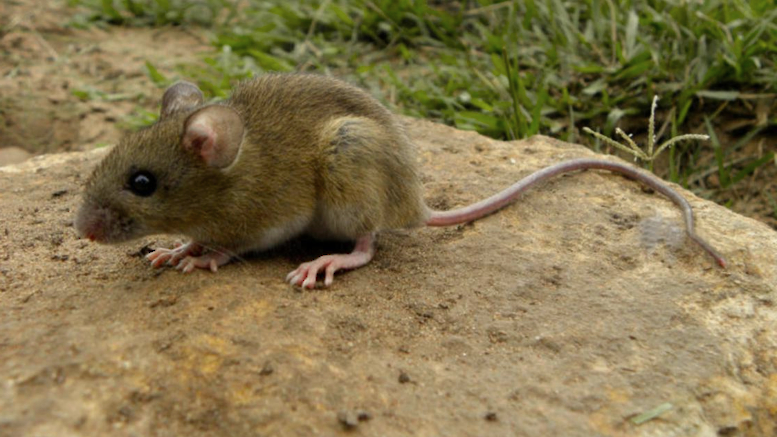

# Contexto

El hantavirus es una zoonosis viral transmitida principalmente por la inhalación de aerosoles en las excreciones del roedor reservorio *Oligoryzomys longicaudatus* ("ratón colilargo"). Neuquén integra, junto con Río Negro y Chubut, la **región Sur**, la única zona del mundo donde se documentó transmisión interhumana del linaje *Andes Sur*. Según el Ministerio de Salud provincial, el promedio histórico ronda los **2 casos confirmados por año**, con picos de hasta 8 casos (2001). A nivel nacional, la letalidad del síndrome cardiopulmonar osciló entre **10% y 32%** en el período 2019-2024.

::: {.callout-note}
La serie anual 2010-2025 de esta sección combina cifras publicadas (promedio histórico, ausencia de casos 2014-2016) con una reconstrucción **ilustrativa** año a año, ya que no se dispone de acceso público al detalle interanual completo. La tabla de casos individuales es un conjunto **simulado**, construido para respetar las proporciones documentadas. No representa personas reales. Lo mismo aplica a la sección **"Regiones Sanitarias"** más abajo: tanto la división territorial como los casos y la población asignados a cada región son **inventados con fines ilustrativos**, no deben ser considerados un registro oficial por zona.
:::


```{r}
#| label: setup
#| include: false
library(tidyverse)
library(plotly)
library(sf)
library(DT)
library(crosstalk)
library(scales)

theme_set(
  theme_minimal(base_size = 12) +
    theme(
      panel.grid.minor = element_blank(),
      plot.title = element_blank()
    )
)
```

```{r}
#| label: casos-anuales
#| message: false
casos_anuales <- tibble(
  anio = 2010:2025,
  casos = c(7, 2, 2, 4, 3, 3, 6, 2, 3, 4, 1, 2, 3, 2, 4, 3),
  fallecidos = c(1, 2, 1, 1, 2, 5, 2, 1, 1, 1, 0, 1, 1, 0, 1, 1)
) |>
  mutate(
    letalidad = if_else(
      casos > 0,
      round(100 * fallecidos / casos, 1),
      0
    )
  )

```

# Evolución anual de casos y letalidad

::: panel-tabset
## Casos confirmados

```{r}
#| echo: false
p_casos_hanta <- ggplot(
  casos_anuales,
  aes(
    x = anio,
    y = casos,
    group = 1,
    text = paste0(
      "<b>Año:</b> ", anio,
      "<br><b>Casos confirmados:</b> ", casos
    )
  )
) +
  geom_area(
    fill = "#6a994e",
    alpha = 0.12
  ) +
  geom_line(
    linewidth = 1,
    color = "#6a994e"
  ) +
  geom_point(
    size = 2,
    color = "#283618"
  ) +
  scale_x_continuous(
    breaks = casos_anuales$anio
  ) +
  scale_y_continuous(
    breaks = scales::pretty_breaks(n = 6),
    expand = expansion(mult = c(0, 0.15))
  ) +
  labs(
    x = NULL,
    y = "Casos confirmados"
  ) +
  theme_minimal(base_size = 12) +
  theme(
    panel.grid.minor = element_blank(),
    panel.grid.major.x = element_blank(),
    axis.text.x = element_text(angle = 45, hjust = 1),
    axis.title.y = element_text(face = "bold")
  )

ggplotly(
  p_casos_hanta,
  tooltip = "text"
)
```

## Fallecidos

```{r}
#| echo: false

p_fallecidos_hanta <- ggplot(
  casos_anuales,
  aes(
    x = anio,
    y = fallecidos,
    group = 1,
    text = paste0(
      "<b>Año:</b> ", anio,
      "<br><b>Fallecidos:</b> ", fallecidos
    )
  )
) +
  geom_area(
    fill = "#1a759f",
    alpha = 0.12
  ) +
  geom_line(
    linewidth = 1,
    color = "#1a759f"
  ) +
  geom_point(
    size = 2,
    color = "#184e77"
  ) +
  scale_x_continuous(
    breaks = casos_anuales$anio
  ) +
  scale_y_continuous(
    breaks = scales::pretty_breaks(n = 6),
    expand = expansion(mult = c(0, 0.15))
  ) +
  labs(
    x = NULL,
    y = "Fallecidos"
  ) +
  theme_minimal(base_size = 12) +
  theme(
    panel.grid.minor = element_blank(),
    panel.grid.major.x = element_blank(),
    axis.text.x = element_text(angle = 45, hjust = 1),
    axis.title.y = element_text(face = "bold")
  )

ggplotly(
  p_fallecidos_hanta,
  tooltip = "text"
)
```

## Letalidad (%)

```{r}
#| echo: false
p_letalidad_hanta <- ggplot(
  casos_anuales,
  aes(
    x = anio,
    y = letalidad,
    group = 1,
    text = paste0(
      "<b>Año:</b> ", anio,
      "<br><b>Letalidad:</b> ", letalidad
    )
  )
) +
  geom_area(
    fill = "#dc2f02",
    alpha = 0.12
  ) +
  geom_line(
    linewidth = 1,
    color = "#dc2f02"
  ) +
  geom_point(
    size = 2,
    color = "#6a040f"
  ) +
  scale_x_continuous(
    breaks = casos_anuales$anio
  ) +
  scale_y_continuous(
    breaks = scales::pretty_breaks(n = 6),
    expand = expansion(mult = c(0, 0.15))
  ) +
  labs(
    x = NULL,
    y = "Letalidad %"
  ) +
  theme_minimal(base_size = 12) +
  theme(
    panel.grid.minor = element_blank(),
    panel.grid.major.x = element_blank(),
    axis.text.x = element_text(angle = 45, hjust = 1),
    axis.title.y = element_text(face = "bold")
  )

ggplotly(
  p_letalidad_hanta,
  tooltip = "text"
)
```
:::

```{r}
summary(casos_anuales)
```


**Lectura rápida:** 
Entre 2010 y 2025 se registraron **3,2 casos/año**, con un máximo de 7 casos en 2010. El promedio de fallecidos fue de **1,3 fallecidos/año** , alcanzando un máximo de 5 fallecimientos en 2015
La letalidad media fue de **44,1%**, mientras que la mediana fue de **33,3%**, lo que indica una importante variabilidad entre años. El máximo observado de 166,7% no es epidemiológicamente interpretable como una letalidad, ya que implica más fallecidos que casos registrados en ese año, probablemente debido a diferencias temporales entre la ocurrencia de casos y fallecimientos o a inconsistencias en la base. Por lo tanto, este valor debería revisarse.

# Perfil epidemiológico de los casos

::: {.callout-note}
**Nota metodológica:** 
El registro individual fue **simulado** y tiene finalidad exclusivamente ilustrativa. Fue construido para representar patrones generales descritos para la enfermedad en la provincia, pero no corresponde a personas ni registros epidemiológicos reales. Por lo tanto, los gráficos permiten explorar la estructura de un conjunto de datos de ejemplo, pero **no deben interpretarse como estimaciones epidemiológicas de la población de Neuquén**
:::

```{r}
#| label: linea-de-casos
#| echo: false
linea_de_casos <- tribble(
  ~anio, ~sexo,    ~grupoEtario, ~entorno,
  2018,  "Varón",  "20-49",      "Rural",
  2018,  "Varón",  "20-49",      "Rural",
  2018,  "Mujer",  "50+",        "Periurbano",
  2019,  "Varón",  "20-49",      "Rural",
  2019,  "Varón",  "15-19",      "Rural",
  2019,  "Varón",  "20-49",      "Periurbano",
  2019,  "Mujer",  "20-49",      "Rural",
  2021,  "Varón",  "20-49",      "Rural",
  2021,  "Varón",  "50+",        "Rural",
  2022,  "Varón",  "20-49",      "Rural",
  2022,  "Varón",  "0-14",       "Rural",
  2022,  "Mujer",  "20-49",      "Periurbano",
  2024,  "Varón",  "20-49",      "Rural",
  2024,  "Varón",  "20-49",      "Rural",
  2024,  "Mujer",  "50+",        "Rural",
  2024,  "Varón",  "20-49",      "Periurbano",
  2025,  "Varón",  "20-49",      "Rural",
  2025,  "Varón",  "20-49",      "Rural",
  2025,  "Mujer",  "20-49",      "Rural"
)


linea_de_casos_filtrable <- bind_rows(
  linea_de_casos |> mutate(filtro_sexo = "Todos"),
  linea_de_casos |> mutate(filtro_sexo = sexo)
) |>
  mutate(filtro_sexo = factor(filtro_sexo, levels = c("Todos", "Varón", "Mujer")))

resumen_por_dimension <- function(datos, dimension, etiqueta_col) {
  datos |>
    count(filtro_sexo, categoria = .data[[dimension]], name = "casos") |>
    mutate(dimension = etiqueta_col)
}

resumen_sexo      <- resumen_por_dimension(linea_de_casos_filtrable, "sexo", "Sexo")
resumen_etario     <- resumen_por_dimension(linea_de_casos_filtrable, "grupoEtario", "Grupo etario")
resumen_entorno     <- resumen_por_dimension(linea_de_casos_filtrable, "entorno", "Entorno")

sd_tabla    <- SharedData$new(linea_de_casos_filtrable, group = "filtro_hanta")
sd_sexo     <- SharedData$new(resumen_sexo,   group = "filtro_hanta")
sd_etario   <- SharedData$new(resumen_etario, group = "filtro_hanta")
sd_entorno  <- SharedData$new(resumen_entorno, group = "filtro_hanta")


```


::: panel-tabset
## Sexo

```{r}
#| echo: false
#| warning: false

datos_sexo <- resumen_sexo |>
  filter(filtro_sexo == "Todos") |>
  mutate(
    porcentaje = casos / sum(casos) * 100,
    etiqueta = paste0(
      categoria,
      "<br>",
      casos,
      " casos",
      "<br>",
      round(porcentaje, 1),
      "%"
    )
  )

plot_ly(
  datos_sexo,
  labels = ~categoria,
  values = ~casos,
  type = "pie",
  text = ~etiqueta,
  textinfo = "text",
  hoverinfo = "text",
  marker = list(
    colors = c("#e26d5c", "#00798c"),
    line = list(
      color = "#FFFFFF",
      width = 2
    )
  ),
  hole = 0
) |>
  layout(
    showlegend = TRUE,
    legend = list(
      orientation = "h",
      x = 0.5,
      xanchor = "center",
      y = -0.1
    ),
    margin = list(
      l = 20,
      r = 20,
      t = 20,
      b = 60
    )
  )
```

## Grupo etario

```{r}
#| echo: false
#| warning: false

datos_etario <- resumen_etario |>
  filter(filtro_sexo == "Todos") |>
  mutate(
    categoria = factor(
      categoria,
      levels = c("0-14", "15-19", "20-49", "50+")
    )
  )

p_etario <- ggplot(
  datos_etario,
  aes(
    x = categoria,
    y = casos,
    fill = categoria,
    text = paste0(
      "<b>Grupo etario:</b> ", categoria,
      "<br><b>Casos:</b> ", casos
    )
  )
) +
  geom_col(
    width = 0.75
  ) +
  geom_text(
    aes(label = casos),
    vjust = 0.1,
    fontface = "bold",
    size = 4
  ) +
  scale_fill_manual(
    values = c(
      "0-14" = "#90BE6D",
      "15-19" = "#43AA8B",
      "20-49" = "#277DA1",
      "50+"   = "#577590"
    )
  ) +
  scale_y_continuous(
    expand = expansion(mult = c(0, 0.15)),
    breaks = scales::pretty_breaks(n = 6)
  ) +
  labs(
    x = "Grupo etario",
    y = "Cantidad de casos"
  ) +
  theme_minimal(base_size = 12) +
  theme(
    panel.grid.minor = element_blank(),
    panel.grid.major.x = element_blank(),
    axis.title.x = element_text(face = "bold"),
    axis.title.y = element_text(face = "bold"),
    axis.text.x = element_text(face = "bold"),
    legend.position = "none"
  )

p_etario
```

## Entorno

```{r}
#| echo: false
#| warning: false

datos_entorno <- resumen_entorno |>
  filter(filtro_sexo == "Todos") |>
  mutate(
    porcentaje = casos / sum(casos),
    porcentaje_txt = scales::percent(porcentaje, accuracy = 1)
  )

# Función para crear los pictogramas
crear_pictograma <- function(entorno, casos, porcentaje) {

  if (entorno == "Rural") {

    icono <- paste0(
      '<svg width="180" height="220" viewBox="0 0 180 220">',
      
      # Tronco
      '<rect x="80" y="145" width="20" height="55"
             rx="4" fill="#8c6b43"/>',
      
      # Copa vacía
      '<circle cx="90" cy="95" r="65"
              fill="#e8e8e8"/>',
      
      # Copa llena
      '<clipPath id="clipTree">',
      '<circle cx="90" cy="95" r="65"/>',
      '</clipPath>',
      
      paste0(
        '<rect x="25" y="',
        160 - (130 * porcentaje),
        '" width="130" height="130"
               fill="#6a994e"
               clip-path="url(#clipTree)"/>'
      ),
      
      '</svg>'
    )

  } else {

    icono <- paste0(
      '<svg width="180" height="220" viewBox="0 0 180 220">',
      
      # Casa vacía
      '<path d="M20 95 L90 30 L160 95 V195 H20 Z"
             fill="#e8e8e8"/>',
      
      # Casa llena
      '<clipPath id="clipHouse">',
      '<path d="M20 95 L90 30 L160 95 V195 H20 Z"/>',
      '</clipPath>',
      
      paste0(
        '<rect x="20" y="',
        195 - (165 * porcentaje),
        '" width="140" height="165"
               fill="#bc6c25"
               clip-path="url(#clipHouse)"/>'
      ),
      
      # Puerta
      '<rect x="75" y="145" width="30" height="50"
             fill="white" opacity="0.8"/>',
      
      '</svg>'
    )
  }

  icono
}


# Crear tarjetas HTML
tarjetas <- lapply(
  seq_len(nrow(datos_entorno)),
  function(i) {

    d <- datos_entorno[i, ]

    pictograma <- crear_pictograma(
      d$categoria,
      d$casos,
      d$porcentaje
    )

    paste0(
      '<div style="
        text-align:center;
        flex:1;
        min-width:250px;
        padding:20px;
      ">',
      
      '<div style="
        font-size:20px;
        font-weight:600;
        margin-bottom:10px;
      ">',
      d$categoria,
      '</div>',
      
      pictograma,
      
      '<div style="
        font-size:28px;
        font-weight:700;
        margin-top:-10px;
      ">',
      d$porcentaje_txt,
      '</div>',
      
      '<div style="
        font-size:15px;
        color:#666;
        margin-top:5px;
      ">',
      d$casos,
      ' casos',
      '</div>',
      
      '</div>'
    )
  }
)

htmltools::HTML(
  paste0(
    '<div style="
      display:flex;
      justify-content:center;
      align-items:center;
      gap:50px;
      flex-wrap:wrap;
      margin:20px 0;
    ">',
    paste(tarjetas, collapse = ""),
    '</div>'
  )
)
```
:::


# Distribución geográfica: Regiones Sanitarias

::: {.callout-note}
Los datos de referenciación geográfico no son de acceso público debido a la sensibilidad del dato, evitando acciones malintencionadas. Para este mapa **se inventó la variable "Región Sanitaria"** agrupando departamentos y localidades en 6 zonas (algunas reales y otras ficticias) (Confluencia, Vaca Muerta , del Pehuén, Alto Neuquén, de los Lagos del Sur y Cordillera). Tanto los límites de cada región como los casos y la población asignados son **estimaciones ficticias**, distribuidas para reflejar que el hantavirus es una enfermedad de exposición predominantemente rural: no corresponden a datos reales por localidad.
:::

```{r}
#| label: prep-regiones-sf-hanta
#| echo: false
#| warning: false
#| message: false
library(sf)
library(dplyr)
library(leaflet)
library(htmltools)

geojson_neuquen <- r"({"type": "FeatureCollection", "features": [{"type": "Feature", "properties": {"name": "Neuquen"}, "geometry": {"type": "Polygon", "coordinates": [[[-68.258, -37.571], [-68.269, -38.668], [-68.104, -38.814], [-67.994, -38.934], [-68.192, -39.002], [-68.39, -39.036], [-68.5, -39.07], [-68.599, -39.232], [-68.73, -39.275], [-68.917, -39.462], [-69.203, -39.589], [-69.258, -39.682], [-69.434, -39.792], [-69.796, -39.91], [-69.972, -39.977], [-69.95, -40.145], [-70.082, -40.246], [-70.082, -40.363], [-70.159, -40.455], [-70.137, -40.522], [-70.214, -40.522], [-70.291, -40.505], [-70.378, -40.539], [-70.554, -40.505], [-70.642, -40.606], [-70.763, -40.589], [-70.906, -40.606], [-71.016, -40.664], [-71.005, -40.731], [-71.104, -40.764], [-71.093, -40.805], [-71.06, -40.864], [-71.049, -40.922], [-71.049, -40.963], [-71.082, -41.005], [-71.18, -41.063], [-71.334, -41.112], [-71.411, -41.055], [-71.499, -41.021], [-71.598, -41.021], [-71.73, -41.013], [-71.862, -41.005], [-71.884, -40.963], [-71.84, -40.897], [-71.917, -40.83], [-71.949, -40.747], [-71.917, -40.672], [-71.829, -40.639], [-71.796, -40.589], [-71.884, -40.572], [-71.862, -40.505], [-71.829, -40.422], [-71.73, -40.422], [-71.686, -40.397], [-71.642, -40.338], [-71.686, -40.271], [-71.752, -40.229], [-71.763, -40.28], [-71.807, -40.229], [-71.829, -40.154], [-71.818, -40.07], [-71.686, -40.103], [-71.609, -40.095], [-71.675, -40.044], [-71.686, -40.002], [-71.631, -39.943], [-71.598, -39.884], [-71.598, -39.825], [-71.675, -39.809], [-71.697, -39.749], [-71.62, -39.69], [-71.697, -39.64], [-71.752, -39.538], [-71.609, -39.597], [-71.521, -39.673], [-71.422, -39.614], [-71.444, -39.546], [-71.532, -39.529], [-71.499, -39.462], [-71.433, -39.385], [-71.4, -39.334], [-71.334, -39.283], [-71.389, -39.249], [-71.422, -39.19], [-71.444, -39.087], [-71.444, -39.002], [-71.477, -38.925], [-71.378, -38.891], [-71.29, -38.848], [-71.301, -38.763], [-71.202, -38.814], [-71.125, -38.754], [-71.005, -38.746], [-70.917, -38.72], [-70.862, -38.694], [-70.862, -38.634], [-70.829, -38.557], [-70.873, -38.479], [-70.972, -38.454], [-71.005, -38.359], [-70.972, -38.264], [-71.016, -38.186], [-71.049, -38.117], [-70.939, -38.109], [-71.005, -38.057], [-71.049, -38.005], [-71.115, -37.953], [-71.125, -37.892], [-71.147, -37.849], [-71.202, -37.858], [-71.104, -37.762], [-71.158, -37.719], [-71.202, -37.658], [-71.158, -37.614], [-71.125, -37.536], [-71.125, -37.466], [-71.169, -37.396], [-71.235, -37.344], [-71.202, -37.3], [-71.147, -37.239], [-71.093, -37.195], [-71.071, -37.143], [-71.115, -37.073], [-71.169, -36.967], [-71.104, -36.959], [-71.136, -36.906], [-71.158, -36.844], [-71.104, -36.73], [-71.005, -36.704], [-71.016, -36.624], [-71.093, -36.571], [-71.038, -36.536], [-70.983, -36.465], [-70.862, -36.395], [-70.73, -36.439], [-70.675, -36.404], [-70.719, -36.342], [-70.719, -36.271], [-70.609, -36.2], [-70.532, -36.147], [-70.455, -36.2], [-70.411, -36.138], [-70.378, -36.182], [-70.378, -36.271], [-70.378, -36.368], [-70.291, -36.342], [-70.236, -36.342], [-70.214, -36.404], [-70.192, -36.51], [-70.082, -36.616], [-69.983, -36.721], [-69.895, -36.8], [-69.818, -36.88], [-69.741, -36.941], [-69.763, -37.003], [-69.763, -37.073], [-69.609, -37.125], [-69.543, -37.204], [-69.291, -37.143], [-69.17, -37.169], [-69.038, -37.239], [-69.049, -37.318], [-69.049, -37.388], [-68.95, -37.405], [-68.829, -37.37], [-68.719, -37.396], [-68.665, -37.44], [-68.577, -37.449], [-68.478, -37.501], [-68.39, -37.562], [-68.258, -37.571]]]}}]})"

neuquen_sf <- st_read(geojson_neuquen, quiet = TRUE) |> st_make_valid()

# Los 31 casos acumulados 2010-2025 (ver casos_anuales) se reparten de forma
# ilustrativa con más peso relativo en zonas rurales/cordilleranas que en
# la Confluencia, coherente con el perfil de exposición descrito más abajo.
regiones_sanitarias_hanta <- tibble(
  region = c("Confluencia", "del Pehuen", "Vaca Muerta",
             "Alto Neuquén", "Lagos del Sur", "Cordillera"),
  cabecera = c("Neuquén / Plottier / Centenario", "Zapala",
               "Añelo / Rincón de los Sauces", "Chos Malal",
               "San Martín de los Andes / Junín", "Alumine / VIlla Pehuenia"),
  lon = c(-68.10, -70.06, -68.85, -70.27, -71.35, -71.00),
  lat = c(-38.92, -38.90, -37.85, -37.38, -40.16, -39.10),
  poblacion = c(520000, 45000, 35000, 40000, 55000, 15000),
  casos = c(6, 5, 6, 6, 5, 3)
) |>
  mutate(tasa_acumulada = round(100000 * casos / poblacion, 1))

regiones_pts_hanta <- st_as_sf(
  regiones_sanitarias_hanta,
  coords = c("lon", "lat"), crs = 4326, remove = FALSE
)

envolvente_hanta <- st_as_sfc(st_bbox(neuquen_sf) + c(-1, -1, 1, 1) * 0.5)

voronoi_raw_hanta <- st_voronoi(st_union(regiones_pts_hanta), envelope = envolvente_hanta) |>
  st_collection_extract("POLYGON") |>
  st_sf(crs = st_crs(neuquen_sf))

regiones_poly_hanta <- st_join(voronoi_raw_hanta, regiones_pts_hanta, join = st_intersects, largest = TRUE) |>
  filter(!is.na(region)) |>
  st_intersection(st_union(neuquen_sf))
```

```{r}
#| label: mapa-regiones-hanta-leaflet
#| echo: false
#| warning: false

pal_tasa_hanta  <- colorNumeric("inferno", domain = regiones_poly_hanta$tasa_acumulada, reverse = TRUE)
pal_casos_hanta <- colorNumeric("viridis", domain = regiones_poly_hanta$casos, reverse = TRUE)

popup_html_hanta <- sprintf(
  "<div style='font-family:sans-serif; line-height:1.4;'>
     <strong style='font-size:14px; color:#2c3e50;'>%s</strong><br/>
     <span style='color:#666;'>Cabecera: %s</span><br/>
     Casos acumulados (2010-2025): <b>%s</b><br/>
     Tasa acumulada: <b>%s</b> / 100.000 hab.<br/>
     Población estimada: %s
   </div>",
  regiones_poly_hanta$region, regiones_poly_hanta$cabecera, regiones_poly_hanta$casos,
  regiones_poly_hanta$tasa_acumulada, format(regiones_poly_hanta$poblacion, big.mark = ".")
)

leaflet(regiones_poly_hanta, options = leafletOptions(minZoom = 6, maxZoom = 10)) |>
  addProviderTiles("CartoDB.PositronNoLabels") |>
  addPolygons(
    fillColor = ~pal_tasa_hanta(tasa_acumulada), fillOpacity = 0.78,
    color = "#ffffff", weight = 1.5,
    label = lapply(popup_html_hanta, HTML),
    popup = popup_html_hanta,
    highlightOptions = highlightOptions(weight = 3, color = "#2c3e50", bringToFront = TRUE),
    group = "Tasa acumulada 2010-2025"
  ) |>
  addPolygons(
    fillColor = ~pal_casos_hanta(casos), fillOpacity = 0.78,
    color = "#ffffff", weight = 1.5,
    label = lapply(popup_html_hanta, HTML),
    popup = popup_html_hanta,
    highlightOptions = highlightOptions(weight = 3, color = "#2c3e50", bringToFront = TRUE),
    group = "Casos acumulados"
  ) |>
  addLabelOnlyMarkers(
    data = regiones_pts_hanta,
    label = ~region,
    labelOptions = labelOptions(
      noHide = TRUE, direction = "center", textOnly = TRUE,
      style = list("font-weight" = "600", "color" = "#2c3e50", "font-size" = "11px",
                   "text-shadow" = "0 0 3px #fff, 0 0 3px #fff")
    )
  ) |>
  addLegend(pal = pal_tasa_hanta, values = ~tasa_acumulada, title = "Tasa acum. /100.000",
            group = "Tasa acumulada 2010-2025", position = "bottomright") |>
  addLegend(pal = pal_casos_hanta, values = ~casos, title = "Casos acum.",
            group = "Casos acumulados", position = "bottomright") |>
  addLayersControl(
    baseGroups = c("Tasa acumulada 2010-2025", "Casos acumulados"),
    options = layersControlOptions(collapsed = FALSE)
  )
```


**Lectura rápida:** 
en esta reconstrucción ilustrativa, la Confluencia concentra pocos casos absolutos en relación con su población y presenta la **tasa acumulada más baja** de las seis regiones, mientras que zonas de menor densidad y más asociadas a actividad rural —Pehuenia, Vaca Muerta - Añelo y Alto Neuquen— muestran tasas relativas más altas. Este patrón geográfico simulado es consistente con la asociación epidemiológica real entre exposición a tareas rurales/periurbanas (desmalezado, galpones, viviendas cerradas) y riesgo de hantavirosis descripta en distintos informes epidemiológicos de la provincia.
El mapa interactivo nos permitiría, al usar datos reales, georeferencias los casos para reorientar la estrategias territoriales y las campañas de prevención (limpieza segura de espacios cerrados, control de roedores) hacia las regiones sanitarias de mayor tasa relativa con el fin de distribuir eficientemente los recursos sanitarios disponibles.

## Conclusión

Se observa una tendencia en el perfil epidemiológico de esta simulación, similar a lo descrito por distintos organismos estatales: **predominio de varones, concentración de los casos en adultos jóvenes y mayor presencia de exposiciones asociadas a entornos rurales o periurbanos**.

El predominio de sexo legal masculino podría relacionarse con una mayor exposición a entornos laborales (por lo general, precarizados) que coinciden con los hábitos del roedor, como tareas rurales, desmalezado, limpieza de galpones, manipulación de leña o ingreso a viviendas cerradas durante períodos prolongados. Sin embargo, **el riesgo no es exclusivamente ocupacional ni rural**, ya que la exposición puede producirse también en viviendas y espacios periurbanos.

La distribución etaria muestra una concentración en adultos jóvenes y de mediana edad, aunque el hantavirus puede afectar a personas de cualquier grupo etario. La presencia de casos pediátricos o en personas mayores, por lo tanto, no debe considerarse excepcional ni utilizarse para descartar el diagnóstico ante un cuadro clínico compatible.

En relación con el **entorno**, la clasificación rural/periurbano resulta epidemiológicamente relevante porque permite aproximarse a la situación de exposición. Más que considerar el área geográfica como un factor de riesgo aislado, resulta útil identificar **qué actividades y condiciones ambientales favorecen el contacto con las excretas de roedores**, incluyendo acumulación de materiales y/o residuos, viviendas cerradas, almacenamiento de leña y falta de limpieza de espacios potencialmente contaminados. La lectura por región sanitaria de la sección anterior, aunque ilustrativa, refuerza esta idea: el riesgo relativo tiende a concentrarse fuera de la Confluencia, en las zonas con mayor peso de actividad rural y cordillerana.

En conclusión, se sugiere reforzar y direccionar las estrategias territoriales hacia acciones alineadas con la APS, como **prevención primaria y la vigilancia epidemiológica**. En una enfermedad de baja frecuencia pero potencialmente grave, la identificación oportuna de antecedentes de exposición y el reconocimiento temprano de síntomas compatibles son esenciales para reducir complicaciones y mejorar la oportunidad de atención.

::: {.callout-note}
**Interpretación de los datos:** 
dado que el registro individual utilizado en esta sección es simulado, las distribuciones observadas en los gráficos **no deben interpretarse como prevalencias, tasas ni proporciones reales de los casos de hantavirus en Neuquén**. Su función es exclusivamente demostrativa y puede reemplazarse posteriormente por los registros reales. Lo mismo aplica al mapa es una construcción ficticia y no un dato oficial georreferenciado.
:::

## Fuentes

- Ministerio de Salud de Neuquén, ["Hantavirus"](https://salud.neuquen.gob.ar/wp-content/uploads/2024/09/Hantavirus.pdf)
- Neuquén Informa, ["Hantavirus: más de 20 años de investigación, monitoreo y prevención"](https://www.neuqueninforma.gob.ar/noticias/2026/05/11/257448-hantavirus-mas-de-20-anos-de-investigacion-monitoreo-y-prevencion)
- Infobae, ["Hantavirus en Argentina: se notificaron 42 casos en lo que va del año"](https://www.infobae.com/salud/2026/05/06/hantavirus-en-argentina-se-notificaron-42-casos-en-lo-que-va-del-ano/)

